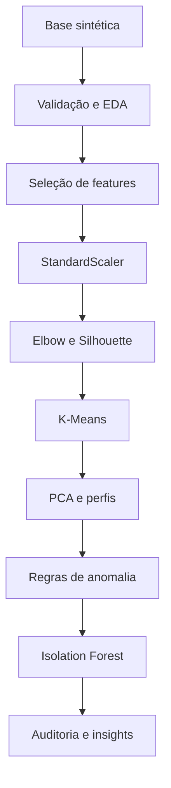
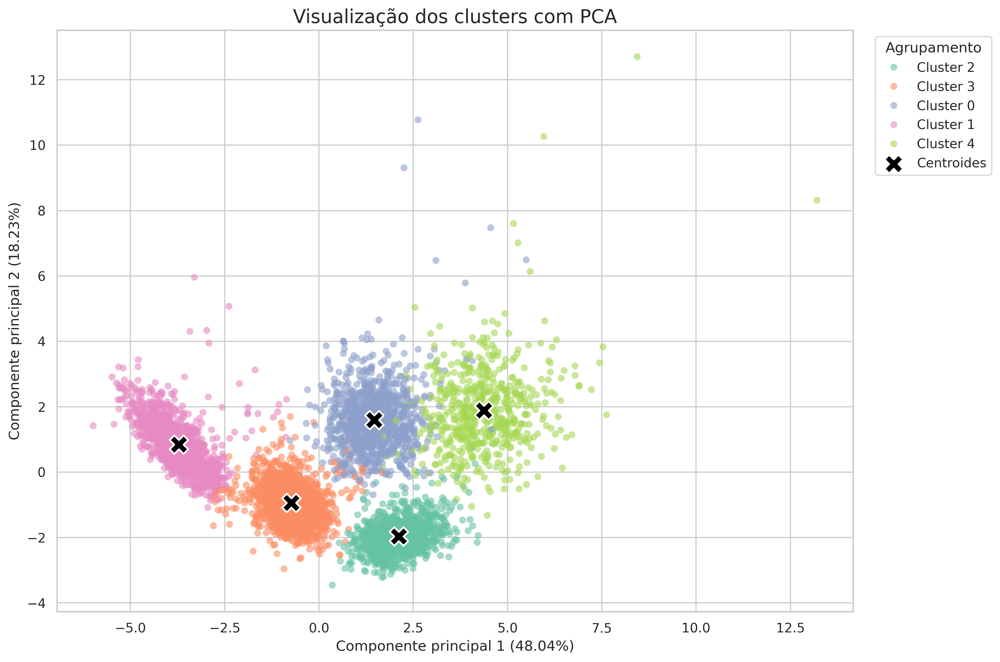
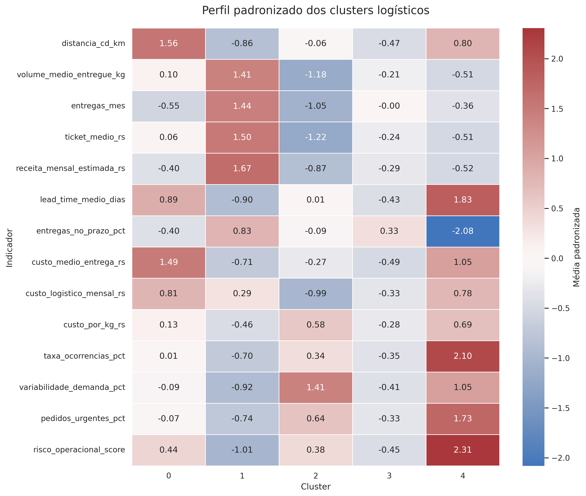
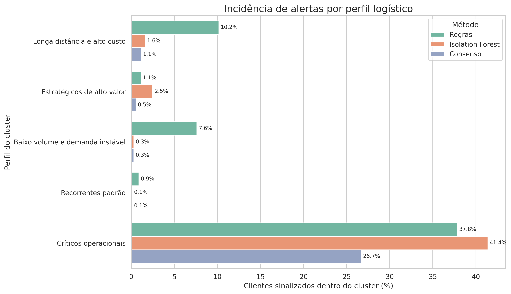

# 🚚 Supply Chain AI: Segmentação de Clientes e Detecção de Anomalias

> Projeto acadêmico de Inteligência Artificial aplicada à Supply Chain para segmentar clientes logísticos, detectar comportamentos fora do padrão e apoiar decisões sobre custo, nível de serviço e risco operacional.

[](https://colab.research.google.com/github/thedrads/supply-chain-clustering-anomaly-ai/blob/main/notebooks/supply_chain_clustering_anomaly_ai.ipynb)


## 📌 Resumo executivo

Este projeto foi desenvolvido como entrega final da disciplina **Supply Chain & Logística Inteligente com IA**.

Uma empresa fictícia de distribuição atende clientes com diferentes perfis de volume, distância, frequência, custo, prazo e risco. O projeto utiliza análise de dados e machine learning para transformar essas diferenças em segmentos gerenciais e alertas operacionais.

A solução identificou **cinco clusters logísticos** e aplicou duas abordagens complementares de detecção de anomalias:

- regras explicáveis baseadas em percentis;
- Isolation Forest para padrões multivariados incomuns.

O principal resultado gerencial foi a identificação do grupo **Críticos operacionais**, que representa somente 9,87% da base, mas concentra aproximadamente 86,81% dos alertas detectados simultaneamente pelos dois métodos.

## 📑 Sumário

- [Sobre o projeto](#-sobre-o-projeto)
- [Problema de negócio](#-problema-de-negócio)
- [Solução analítica](#-solução-analítica)
- [Pipeline](#-pipeline)
- [Dataset](#-dataset)
- [Metodologia](#-metodologia)
- [Principais resultados](#-principais-resultados)
- [Perfis logísticos](#-perfis-logísticos)
- [Detecção de anomalias](#-detecção-de-anomalias)
- [Visualizações](#-visualizações)
- [Insights e recomendações](#-insights-e-recomendações)
- [Limitações](#-limitações)
- [Estrutura do repositório](#-estrutura-do-repositório)
- [Tecnologias](#-tecnologias)
- [Como executar](#-como-executar)
- [Uso de IA generativa](#-uso-de-ia-generativa)
- [Autor](#-autor)
- [Licença](#-licença)

## 🎯 Sobre o projeto

A linha escolhida para o projeto foi:

> **Identificação de Clusters e Detecção de Anomalia.**

O objetivo é segmentar clientes logísticos, identificar comportamentos fora do padrão e gerar recomendações sobre:

- custo logístico;
- nível de serviço;
- risco operacional;
- planejamento da demanda;
- priorização de clientes.

## 💼 Problema de negócio

Tratar todos os clientes da mesma forma pode gerar:

- aumento de custos;
- rotas pouco eficientes;
- redução da pontualidade;
- clientes críticos sem monitoramento;
- decisões baseadas apenas em percepção.

A pergunta central do projeto é:

> Como segmentar clientes logísticos e identificar comportamentos fora do padrão para apoiar decisões relacionadas a custo, nível de serviço, risco operacional e priorização?

## 🧠 Solução analítica

A solução combina análise exploratória, clusterização e detecção de anomalias.

Foram utilizadas 14 variáveis numéricas relacionadas a:

- distância e volume;
- frequência e valor econômico;
- lead time e pontualidade;
- custos logísticos;
- ocorrências e urgências;
- variabilidade da demanda;
- risco operacional.

As colunas sintéticas de auditoria foram excluídas do treinamento e consultadas somente após a conclusão dos modelos.

## 🔬 Pipeline



## 📋 Dataset

| Informação | Detalhe |
|---|---|
| Origem | Base sintética criada para o projeto |
| Arquivo | `clientes_logisticos_sinteticos_supply_chain.csv` |
| Registros | 6.000 |
| Colunas | 23 |
| Features de clusterização | 14 |
| Dados pessoais ou sensíveis | Não possui |
| Carregamento | URL pública do GitHub |
| Uso | EDA, clusterização e detecção de anomalias |

A base está disponível em [`data/synthetic/`](data/synthetic/clientes_logisticos_sinteticos_supply_chain.csv).

O significado das variáveis está documentado no [dicionário de dados](docs/DICIONARIO_DADOS_CLIENTES_LOGISTICOS.md).

## 🧪 Metodologia

1. Carregamento direto do GitHub.
2. Validação de dimensões, tipos, valores ausentes e duplicidades.
3. Análise exploratória numérica e categórica.
4. Seleção de 14 features operacionais.
5. Padronização com `StandardScaler`.
6. Avaliação de `K` pelo Método do Cotovelo.
7. Comparação pelo Silhouette Score.
8. Clusterização final com K-Means.
9. Visualização em duas dimensões com PCA.
10. Interpretação numérica e categórica dos clusters.
11. Detecção por regras baseadas nos percentis 1 e 99.
12. Detecção multivariada com Isolation Forest.
13. Comparação com a auditoria sintética.
14. Geração de insights e recomendações.

## 📈 Principais resultados

| Indicador | Resultado |
|---|---:|
| Número final de clusters | 5 |
| Silhouette Score final | 0,3730 |
| Variância representada pelo PCA | 66,26% |
| Alertas pelas regras | 444 |
| Percentual sinalizado pelas regras | 7,40% |
| Alertas pelo Isolation Forest | 300 |
| Percentual sinalizado pelo Isolation Forest | 5,00% |
| Alertas de consenso | 182 |
| Anomalias sintéticas de auditoria | 210 |
| Cluster mais crítico | Cluster 4 |
| Cluster mais estratégico | Cluster 1 |

## 🧩 Perfis logísticos

| Cluster | Perfil | Participação | Característica principal | Ação recomendada |
|---:|---|---:|---|---|
| 0 | Longa distância e alto custo | 17,55% | Maior distância e custo médio por entrega | Revisar rotas, fretes e consolidação de cargas |
| 1 | Estratégicos de alto valor | 22,18% | Maior receita, volume, frequência e pontualidade | Preservar SLA, capacidade e retenção |
| 2 | Baixo volume e demanda instável | 17,77% | Baixo volume, alta variabilidade e maior custo por kg | Consolidar pedidos e melhorar planejamento |
| 3 | Recorrentes padrão | 32,63% | Frequência média, custo controlado e baixo risco | Padronizar e automatizar processos |
| 4 | Críticos operacionais | 9,87% | Baixa pontualidade, maior lead time, urgência e risco | Priorizar causa raiz, rotas e revisão de SLA |

## 🚨 Detecção de anomalias

### Comparação com a auditoria sintética

| Método | Precisão | Recall | F1 |
|---|---:|---:|---:|
| Regras explicáveis | 30,18% | 63,81% | 40,98% |
| Isolation Forest | 20,00% | 28,57% | 23,53% |

As regras apresentaram maior aderência à auditoria porque as anomalias sintéticas foram inseridas como valores extremos em indicadores específicos.

O Isolation Forest permaneceu como método complementar, pois identifica combinações incomuns que podem não ultrapassar limites individuais.

Os falsos positivos não devem ser interpretados automaticamente como erros. Eles representam casos que merecem investigação operacional.

## 📊 Visualizações

### Projeção dos clusters com PCA



### Perfil padronizado dos clusters



### Incidência de alertas por perfil



## 💡 Insights e recomendações

1. O Cluster 4 deve receber prioridade operacional, pois concentra 158 dos 182 alertas de consenso.
2. O Cluster 1 deve ter seu nível de serviço protegido por planejamento de capacidade e retenção.
3. O Cluster 0 exige revisão de rotas, política de frete e viabilidade econômica.
4. O Cluster 2 pode se beneficiar de consolidação de pedidos e critérios de lote mínimo.
5. O Cluster 3 é o principal candidato à padronização e automação.
6. As regras explicáveis devem ser utilizadas como triagem principal.
7. O Isolation Forest deve complementar a análise de combinações multivariadas.
8. Nenhum alerta deve gerar decisão automática contra um cliente sem investigação operacional.

## ⚠️ Limitações

- A base é sintética e não representa uma empresa real.
- Os clusters dependem das features e do valor de `K`.
- Algumas variáveis possuem correlações elevadas.
- O `StandardScaler` é sensível a valores extremos.
- O PCA representa 66,26% da variância em duas dimensões.
- Os percentis são limites estatísticos, não regras definitivas de negócio.
- A contaminação de 5% do Isolation Forest é uma premissa.
- A auditoria registra apenas as anomalias inseridas intencionalmente.
- Os resultados não demonstram causalidade.

## 📁 Estrutura do repositório

```text
supply-chain-clustering-anomaly-ai/
│
├── assets/
│   └── images/
│       ├── anomaly_alerts_by_cluster.png
│       ├── cluster_profiles_heatmap.png
│       └── pca_clusters.png
│
├── data/
│   └── synthetic/
│       └── clientes_logisticos_sinteticos_supply_chain.csv
│
├── docs/
│   ├── 00_DOC_BASE_PROJETO_FINAL_SUPPLY_CHAIN_IA.md
│   ├── 02_PROMPT_NOVO_CHAT_PROJETO_FINAL.md
│   ├── DICIONARIO_DADOS_CLIENTES_LOGISTICOS.md
│   └── README_MODELO_PROJETO_FINAL_SUPPLY_CHAIN.md
│
├── notebooks/
│   └── supply_chain_clustering_anomaly_ai.ipynb
│
├── reports/
├── .gitignore
├── LICENSE
├── README.md
└── requirements.txt
```

## 🧰 Tecnologias

| Categoria | Tecnologia | Uso |
|---|---|---|
| Linguagem | Python | Desenvolvimento analítico |
| Dados | Pandas e NumPy | Manipulação e análise |
| Visualização | Matplotlib e Seaborn | Gráficos estatísticos |
| Visualização | Plotly | Visualizações interativas disponíveis |
| Machine learning | Scikit-learn | K-Means, PCA, métricas e Isolation Forest |
| Ambiente | Google Colab | Execução do notebook |
| Versionamento | Git e GitHub | Controle de versão e publicação |

## 🚀 Como executar

### Google Colab

1. Clique no botão **Abrir no Google Colab** no início deste README.
2. Selecione **Tempo de execução → Executar tudo**.
3. Aguarde a conclusão das células.

O CSV será carregado diretamente do GitHub. Não é necessário conectar o Google Drive ou fazer upload manual.

### Execução local

```bash
git clone https://github.com/thedrads/supply-chain-clustering-anomaly-ai.git
cd supply-chain-clustering-anomaly-ai
python -m pip install -r requirements.txt notebook
jupyter notebook notebooks/supply_chain_clustering_anomaly_ai.ipynb
```

## 🤖 Uso de IA generativa

Este projeto acadêmico foi desenvolvido com apoio de Inteligência Artificial Generativa para estruturação, revisão, organização do código, documentação e apoio à interpretação dos resultados.

Todas as decisões finais, validações, ajustes e conclusões foram revisadas pelo autor.

## 👤 Autor

**Fábio Andrade**

Gestor financeiro e empreendedor em transição para tecnologia, Inteligência Artificial, dados e cloud.

- GitHub: [@thedrads](https://github.com/thedrads)
- Repositório: [supply-chain-clustering-anomaly-ai](https://github.com/thedrads/supply-chain-clustering-anomaly-ai)

## 📄 Licença

Este projeto está disponibilizado sob a [Licença MIT](LICENSE).
